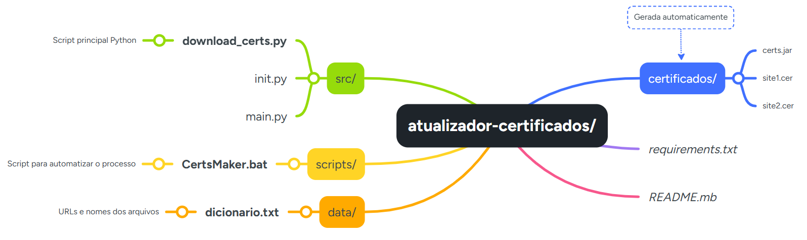

# Projeto de Download de Certificados

## Descrição
Este projeto é uma ferramenta para baixar certificados SSL/TLS de vários sites e salvá-los como arquivos `.cer`. O script em Python utiliza o OpenSSL para buscar certificados de URLs especificadas e organiza, compactando em um único arquivo `.jar`.

## Pré-requisitos

Para executar este projeto, é preciso ter os seguintes softwares instalados:

- **Java JDK 11**: Necessário para criar o arquivo `.jar`.
  - [Download do JDK 11](https://www.oracle.com/java/technologies/javase-jdk11-downloads.html)
- **Python 3.8+**: Necessário para executar o script de download de certificados.
  - [Download do Python](https://www.python.org/downloads/)
- **OpenSSL**: Necessário para a execução do script Python.
  - [Download do OpenSSL](https://slproweb.com/products/Win32OpenSSL.html) (Windows) ou use o gerenciador de pacotes do seu sistema (Linux/macOS).
  - Ou, caso tenha o [Git](https://git-scm.com/) instalado, utilize o `openssl` que já vem nos arquivos do Git. Basta configurar o path nas variáveis de ambiente, caminho padrão: C:\Program Files\Git\mingw64\bin.


## Estrutura de Arquivos

<div style="text-align: center;">
  
</div>


## Como Executar

1. **Preparar o arquivo de entrada**: Crie (ou edite) o arquivo `data/dicionario.txt` e adicione uma lista de sites e nomes de saída, no formato:
    ```txt
    https://exemplo.com, exemplo
    https://sub.dominio.gov.br, certificado_gov
    ```

2. **Executar o processo completo**: No Windows, abra o Prompt de Comando (CMD) e navegue até a pasta `scripts` no caminho padrão:
    ```bash
    cd C:/Projetos/atualizador-certificados/scripts
    ```
    Por exemplo, e execute:
    ```
    CertsMaker.bat
    ```
    **O arquivo `.bat` irá:**
    1. Definir o diretório do Java (`JAVA_HOME`);
    2. Executar o programa Python (`python -m src`);
    3. Criar o arquivo `certs.jar` dentro da pasta `certificados/`.


## Saída esperada
Após a execução, será **criada automaticamente** a pasta `certificados/`, contendo:
* Todos os certificados baixados (`.cer`);
* O arquivo compactado `certs.jar`.


## Solução de Problemas
### **Erro: `No module named src`**
> Ocorre quando o script é executado fora da raiz do projeto.

**Solução:**<br> 
Certifique-se de estar executando o .bat a partir da pasta scripts/.<br>
O arquivo já contém o comando cd /d "%~dp0.." para garantir que o Python rode no diretório correto.

### **Erro: “OpenSSL não é reconhecido como comando interno”**
**Solução:**<br>
Adicione o caminho do OpenSSL às variáveis de ambiente (PATH) do Windows, ou instale via gerenciador de pacotes no Linux/macOS.

### **Certificados não baixados**
**Soluções possíveis:**<br>
* Verifique se as URLs em `data/dicionario.txt` estão corretas e acessíveis.
* Confira se o OpenSSL está funcionando via terminal (`openssl version`).
* Execute o `.bat` novamente com o CMD em modo administrador.